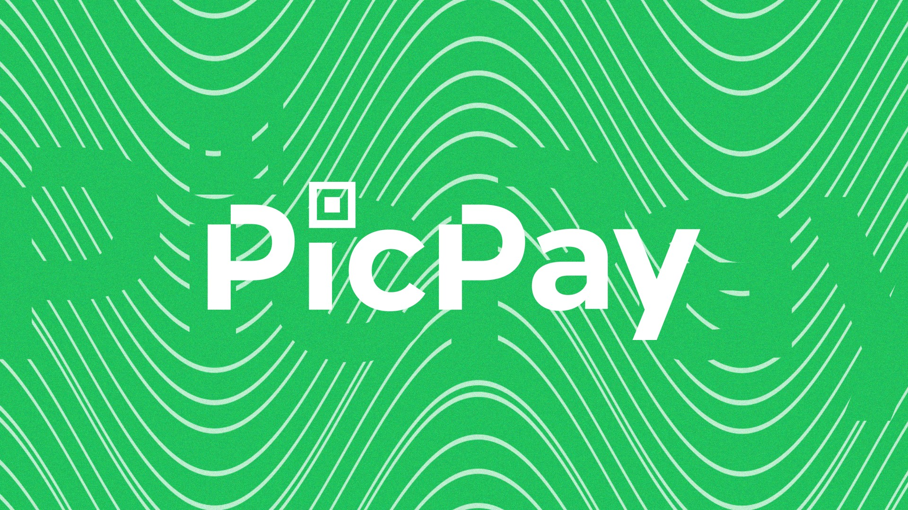

  <h1> Desafio PicPay Simplificado - (Back-end)</h1>
  
  
  
    
  
  
<em>Projeto desenvolvido como solução para o desafio técnico do PicPay</em>

---

## Stacks Usadas:

**Java** • **Maven** • **Spring Boot**

**Lombok** • **DevTools** • **JPA** • **H2 Database**

**Insomnia** • **REST API**

---

## 📋 Sobre o Projeto

Este projeto foi desenvolvido seguindo as especificações do desafio técnico proposto pelo **PicPay**.

## 🔗 Links:

  

---

   
  <em>(Em partes do código usei o Claude 4 Sonnet do IntelliJ Ultimate)</em>

